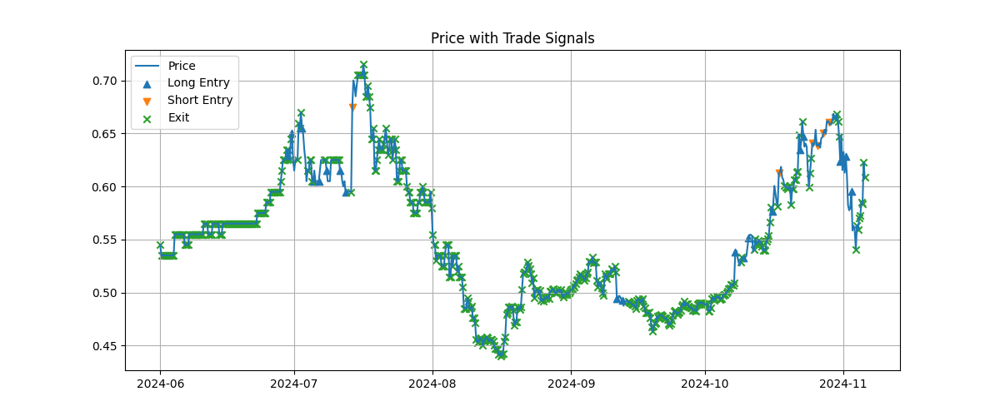
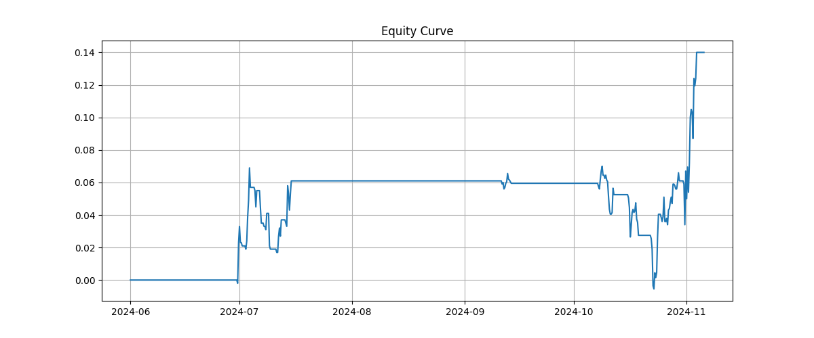
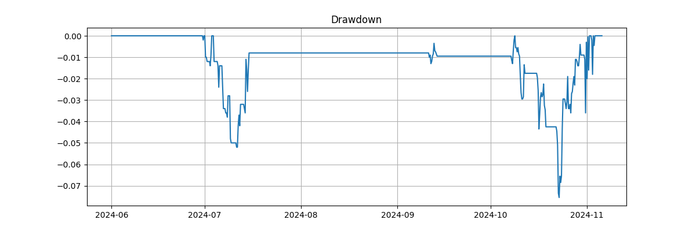

## Overview

This project investigates trading strategies in prediction markets using data from the 2024 U.S. Presidential Election market on Polymarket.

The goal was to model price dynamics in order to identify any exploitable characteristics within prediction markets

---

## Initial Hypothesis

It is assumed that Prediction market prices will exhibit mean reversion around a “fair probability.”

To model this, we may use a log odds-transformation

$$
X_t = \log\left(\frac{p_t}{1 - p_t}\right)
$$

We then use are mean-reverting assumption:

$$
dX_t = \kappa(\mu - X_t)\,dt + \sigma\,dW_t
$$

where:
- $\mu$ is the long-run mean  
- $\kappa$ is the mean reversion speed  
- $\sigma$ is volatility  
---

We define a signal measuring how far the model prediction deviates from the current market price:

$$
Z_t = \frac{\hat{p}_{t+1} - p_t}{\hat{\sigma}_t}
$$

Larger values of $|Z_t|$ may indicate a new information flow impacting the market.

## Final Strategy

The final strategy is:

1. Identify large deviations using the Z-score signal  
2. Filter for high-volatility regimes  
3. Enter in the direction of the move (momentum)  
4. Exit after a short time horizon  

This is an event-driven trading strategy. 

Note: This is a sparse strategy, and still needs to be scaled

---

## Results

### Full Sample Performance

- Total PnL: +0.140  
- Sharpe Ratio: 1.88  
- Number of Trades: 24  
- Win Rate: 58%  
- Max Drawdown: -7.5%  

### Out-of-Sample (October)

- PnL: +0.0205  
- Sharpe: 2.60  

### Low-Activity Period (July–September)

- Near-zero returns  
- Very few trades  

---

---

## Visualizations

### Price and Trade Signals

The chart below shows the market price along with trade entry and exit points.

- Green markers indicate long entries  
- Red markers indicate short entries  
- Black markers indicate exits  

---

### Equity Curve

The cumulative profit and loss of the strategy over time:

---

### Drawdown

Maximum drawdown over time:

## Interpretation

Prediction markets behave differently depending on the level of information flow:

- Low volatility → prices are directionally efficient  
- High volatility → prices exhibit short-term momentum  

A more realistic model is:

$$
dX_t = \mu_t\,dt + \sigma_t\,dW_t + dJ_t
$$

where $dJ_t$ represents information-driven jumps.

The strategy exploits short-term continuation following these events.

---

## Conclusion

The strategy performs only during high-information regimes.

Rather than capturing long-term mispricing, it exploits short-term reaction dynamics in response to new information.

---

## Future Work

- Event classification (debates, news releases)  
- Multi-market signals  
- Higher-frequency execution  
- Application to other prediction markets  
